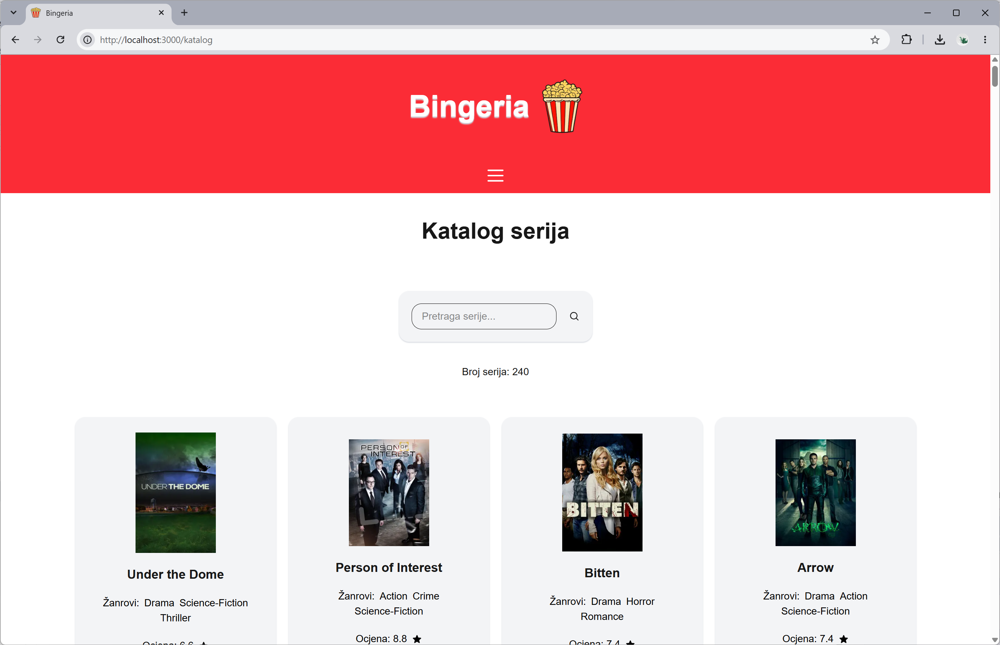
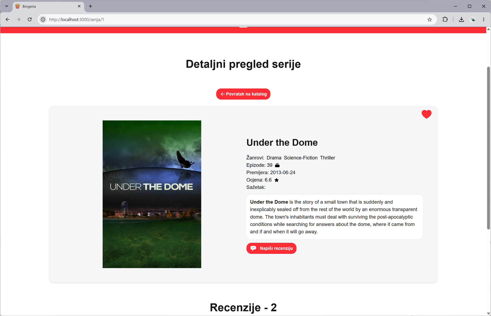
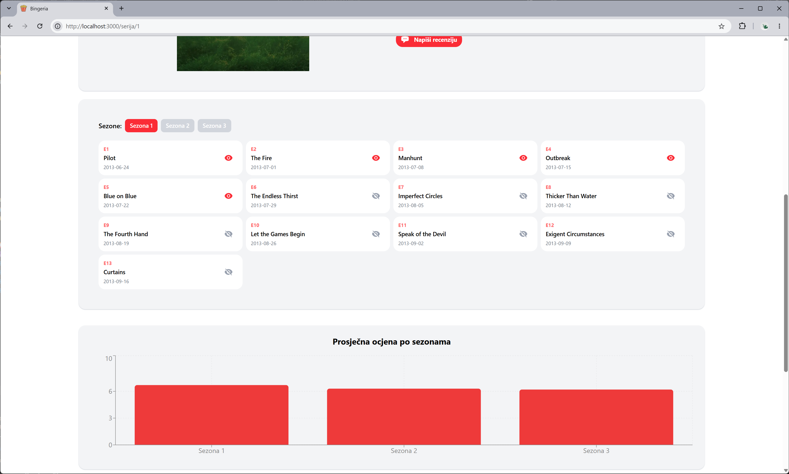
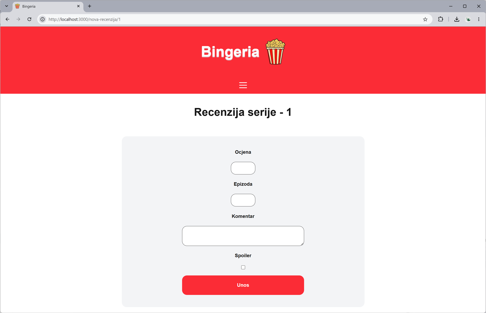

# Domaća zadaća - Bingeria @ Pontis Technology DevCamp 2026
Domaća zadaća iz integrativnog projekta nakon predavanja Frontenda (F1, F2, F3).

## Zadatak

Zadatak je bio izraditi Next.js aplikaciju prema uputama i pravilima u <a href="https://github.com/dominikDjurinic/PontisTechnologyDevCamp/blob/main/dz-bingeria/public/PontisTechDevCamp2026-zadaca-Bingeria.pdf">Zadataku</a>. Pritom je bilo potrebno primijeniti sva dotad stečena znanja iz područja Frontenda u sklopu održanih predavanja.<br/><br/>

## Upute za pokretanje

- **Next.js:**

1. Preuzmite mapu `dz-bingeria`
2. Otvorite terminal i pozicionirajte se u preuzetoj mapi

   ```bash
   cd dz-bingeria
   ```

3. Pokrenite aplikaciju u dev ili build modelu
   Instalirajte potrebne biblioteke iz `package.json` korištenjem naredbe
   
   ```bash
    npm install
   ```

   - dev model rada<br/><br/>

   ```bash
    npm run dev
   ```

    - build model rada (produkcijski model)<br/><br/>
    
   ```bash
    npm run build
    npm start
   ```
<br/><br/>
## Pregled aplikacije

   1.  `/`<br/><br/>
      <br/><br/>
   2. `/katalog`<br/><br/>
      <br/><br/>
   3. `/serija/[id]`<br/><br/>
      <br/><br/>
      <br/><br/>
   4. `/lista`<br/><br/>
      <br/><br/>
   5. `/nova-recenzija/[id]`<br/><br/>
      <br/><br/>


## Odgovori na pitanja

1.  Zašto je tražilica klijentska komponenta, a lista rezultata nije?<br/><br/>
   O: Tražilica je klijentska komponenta ('use client') jer se nad njom vrši izravna interakcija korisnika odnosno mijenja se stanje unosa u realnom vremenu te se programski mijenja URL putanja. S druge strane, lista rezultata je serverska komponenta jer ona dohvaća podatke sa servera u izvornom ili filtriranom obliku s obzirom na pročitanu URL putanju.

2.  Čemu služi grupiranje ruta bez utjecaja na URL?<br/><br/>
   O: Grupiranje ruta se vrši u strukturi aplikacije pomoću zagrada () u nazivu mapa. Grupiranje ruta služi prvenstveno za postizanje preglednije organizacije koda i dokumenata. Također omogućuje izradu layouta za pojedinu grupu ruta što dodatno olakšava implementaciju i usklađenost izgleda ruta. Bitno je naglasiti da grupe ne utječu na URL.
