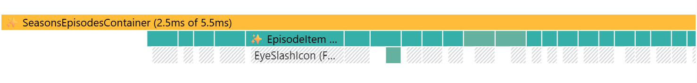
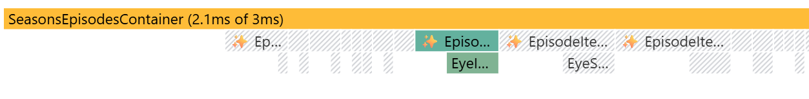
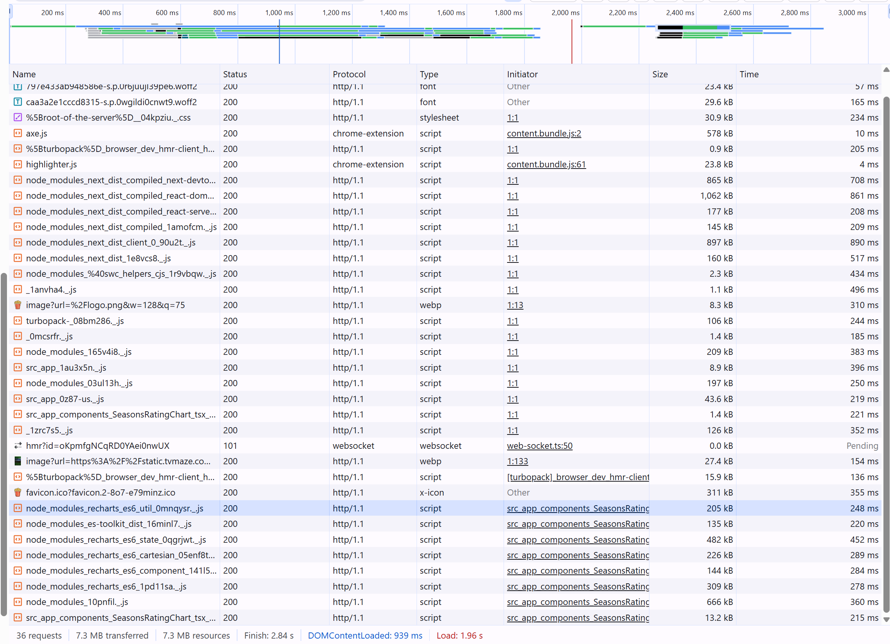

# Domaća zadaća - Bingeria @ Pontis Technology DevCamp 2026

Domaća zadaća iz integrativnog projekta nakon predavanja Frontenda (F1, F2, F3).

## Zadatak

Zadatak je bio izraditi Next.js aplikaciju prema uputama i pravilima u <a href="https://github.com/dominikDjurinic/PontisTechnologyDevCamp/blob/main/dz-bingeria/public/PontisTechDevCamp2026-zadaca-Bingeria.pdf">Zadataku</a>. Pritom je bilo potrebno primijeniti sva dotad stečena znanja iz područja Frontenda u sklopu održanih predavanja.<br/><br/>

## Upute za pokretanje

- **Next.js:**

1.  Preuzmite mapu `dz-bingeria`
2.  Otvorite terminal i pozicionirajte se u preuzetoj mapi

    ```bash
    cd dz-bingeria
    ```

3.  Pokrenite aplikaciju u dev ili build modelu
    Instalirajte potrebne biblioteke iz `package.json` korištenjem naredbe

    ```bash
     npm install
    ```

    - dev model rada<br/><br/>

    ```bash
     npm run dev
    ```

        - build model rada (produkcijski model)<br/><br/>

    ```bash
     npm run build
     npm start
    ```

    <br/><br/>

## Pregled aplikacije

1.  `/`<br/><br/>
    <br/><br/>
2.  `/katalog`<br/><br/>
    <br/><br/>
3.  `/serija/[id]`<br/><br/>
    <br/><br/>
    <br/><br/>
4.  `/lista`<br/><br/>
    <br/><br/>
5.  `/nova-recenzija/[id]`<br/><br/>
    <br/><br/>

## Odgovori na pitanja

1.  Zašto je tražilica klijentska komponenta, a lista rezultata nije?<br/><br/>
    O: Tražilica je klijentska komponenta ('use client') jer se nad njom vrši izravna interakcija korisnika odnosno mijenja se stanje unosa u realnom vremenu te se programski mijenja URL putanja. S druge strane, lista rezultata je serverska komponenta jer ona dohvaća podatke sa servera u izvornom ili filtriranom obliku s obzirom na pročitanu URL putanju.

2.  Čemu služi grupiranje ruta bez utjecaja na URL?<br/><br/>
    O: Grupiranje ruta se vrši u strukturi aplikacije pomoću zagrada () u nazivu mapa. Grupiranje ruta služi prvenstveno za postizanje preglednije organizacije koda i dokumenata. Također omogućuje izradu layouta za pojedinu grupu ruta što dodatno olakšava implementaciju i usklađenost izgleda ruta. Bitno je naglasiti da grupe ne utječu na URL.

<br/><br/>

# Bingeria - drugi dio

## Odgovori na pitanja

### Globalno klijentsko stanje

1. Što je minimum podataka koje treba pohraniti u store i zašto?
   <br/><br/>
   O: U store za globalno stanje klijenta ne pohranjujemo podatke s API već najčešće id koji nam omogućuje naknadni dohvat podataka prema pohranjenom id.
   Razlog je smanjena potrošnja memorije za pohranu velike količine podataka pogotovo objekata, sprječavanje duplikata istih podataka na više mjesta u aplikaciji te brži re-rendering ako dođe do promjene nekih podataka u store.

### Server stanje na klijentu

1. Kada bi u pravom projektu odabrao serverske akcije, a kada ovaj klijentski pristup (TanStackQuery) , i zašto?
   <br/><br/>
   O: Serverske akcije koristimo kod mutacije nad podacima u bazi, najčešće u obliku nekih formi ili brisanja podataka. Također možemo ih koristiti i kod jednostavnijih i statičnih prikaza podataka gdje nema potrebe za stalnim i trenutnim osvježavanjem podataka i manipulacije nad prikazom (sortiranja ili filtracija). Također dobar je za SEO optimizaciju jer se stranice učitavaju već na serveru i odmah su dostupni podaci koje tražilice mogu iskoristiti za indeksiranje i bržu pretragu.
   <br/><br/>
   S druge strane TanStackQuery i slični klijentski pristup ćemo koristiti kada su prikazi puno dinamičniji, podložniji stalnim promjenama i zahtijevaju veliku interaktivnost. Također kad nam je bitno predmemoriranje (caching) podataka ako više komponenti koristi iste podatke pa da nema dodatnog dohvata podataka sa servera. Omogućuje nam i optimistično ažuriranje što dodatno povećava korisničko iskustvo u korištenju aplikacije.

### Profiliranje

1. Snimka Profilera
   1. Prije uvođenja memoizacije na element `EpisodeItem` nakon promjene stanja odgledana
      <br/><br/>
      
      <br/><br/>
   2. Nakon uvođenja memoizacije na element `EpisodeItem` nakon promjene stanja odgledana
      <br/><br/>
      
      <br/><br/>
2. Opis snimke
   1. Prije uvođenja memoizacije na element `EpisodeItem` nakon promjene stanja odgledana
      <br/><br/>

      Trajanje:
      - `SeasonEpisodesContainer` - 2.5ms (Razlog re-rendering: hooks 10 and 16 changed)
      - 22 `EpisodeItem` ukupno - 3 ms (Razlog re-rendering: props changed onToggle)
      - = 5.5 ms ukupni re-rendering
        <br/><br/>

      Broj komponenti:
      - 1 (SeasonEpisodesContainer) + 22 (EpisodeItem) + 1 (EyeIcon)
      - = 24 komponente
        <br/><br/>

      Razlog je promjena u roditeljskoj komponenti `SeasonEpisodesContainer` (promjena stanja odgledano) koja utječe na ponovno renderiranje sve djece `EpisodeItem`.
      <br/><br/>

   2. Nakon uvođenja memoizacije na element `EpisodeItem` nakon promjene stanja odgledana
      <br/><br/>

      Trajanje:
      - `SeasonEpisodesContainer` - 2.1ms (Razlog re-rendering: hooks 10 and 16 changed)
      - 1 `EpisodeItem` ukupno - 0.2 ms (Razlog re-rendering: pprops changed episode)
      - = 3 ms ukupni re-rendering
        <br/><br/>

      Broj komponenti:
      - 1 (SeasonEpisodesContainer) + 1 (EpisodeItem) + 1 (EyeIcon)
      - = 3 komponente
        <br/><br/>

      Razlog je uvođenje memoizacije na komponentu `EpisodeItem` i postavljanje useCallback na funkciju `onToggle` te sada promjena u roditeljskoj komponenti `SeasonEpisodesContainer` (promjena stanja odgledano) utječe samo na ponovno renderiranje dijeteta `EpisodeItem` kod kojeg je došlo do promjene podataka (watched).
      <br/><br/>
      Primijetio sam uvođenje auto-memoizacije (zvjezdice) koju uvodi React compiler, no unatoč tome i dalje je došlo do re-renderinga svih `EpisodeItem` bez memoizacije.

3. Utjecaj promjene teme na re-rendering badge usporedbe
   U implementaciji moje aplikacije promjena stanja teme ne utječe na ponovno učitavanje badge usporedbe. Razlog je odvojenost store za temu `theme` i za usporedbu serija `showsComparison` te oni međusobno nemaju utjecaja.
   <br/><br/>
   Ipak, ako bi koristili zajednički store onda bi moglo doći do re-renderinga jer promjena jednog stanja u store utječe na cijeli store. Navedeni problem možemo riješiti odabirom selektora samo na ono stanje koje nam je potrebno u određenoj komponenti.

### Veće pobjede

1. Snimka Network tab
   <br/><br/>
   
   <br/><br/>
   Snimka nam prikazuje da se pozivi za dohvat grafikona i podataka za izračuna grafikona prosječnih ocjena epizoda po sezonama poziva ne kao dio početnog bundle već na kraju. Poziva ga (initiator) komponenta unutar aplikacije `SeasonsRatingChart`.
   <br/><br/>
   Razlog odvajanja učitavanja - tek kad zatreba (lazy loading) je velika količina podataka koju donosi izrada i izračun grafikona što dodatno usporava rad aplikacije.
